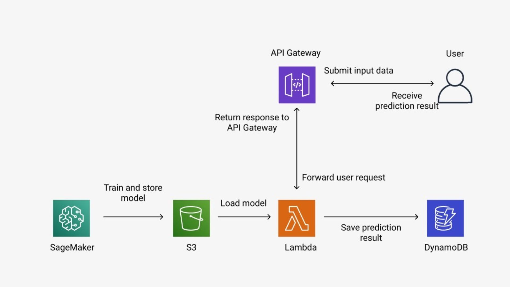
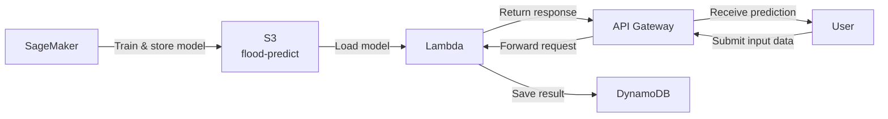

# Flood Prediction System

A Machine Learning system for predicting flood risk, deployed on AWS.

## Architecture





### How It Works

```
SageMaker → S3 → Lambda ← API Gateway ← User
                    ↓
                DynamoDB
```

| Step | Service | Description |
|------|---------|-------------|
| 1 | SageMaker | Train the model and store it in S3 |
| 2 | S3 | Store the model file (`flood_risk_model.pkl`) and dependencies |
| 3 | API Gateway | Receive requests from users and forward to Lambda |
| 4 | Lambda | Load the model from S3 and run prediction |
| 5 | DynamoDB | Save the prediction result |
| 6 | User | Submit input data and receive prediction result |

## Input Features

| Feature | Description |
|---------|-------------|
| `frd_total_rainfall` | Total accumulated rainfall (mm) |
| `Temperature` | Temperature (°C) |
| `Humidity` | Relative humidity (%) |
| `Wind Speed` | Wind speed (km/h) |

## API Usage

**Endpoint:** `POST /predict` (via API Gateway)

**Request Body:**
```json
{
  "data": {
    "frd_total_rainfall": 120.5,
    "Temperature": 30.2,
    "Humidity": 85.0,
    "Wind Speed": 15.3
  }
}
```

**Response (Success):**
```json
{
  "statusCode": 200,
  "prediction": 1
}
```

**Response (Error):**
```json
{
  "statusCode": 400,
  "message": "Missing features: ['Humidity']"
}
```

> `prediction: 1` = Flood risk detected, `prediction: 0` = No flood risk

## AWS Resources

| Resource | Name |
|----------|------|
| S3 Bucket | `flood-predict` |
| S3 Keys | `flood_risk_model.pkl`, `dependencies.zip` |
| Lambda | `lambda_function.py` |

## Project Structure

```
.
├── lambda_function.py   # AWS Lambda handler
├── pipeline.jpg         # Architecture diagram
└── backend/             # Backend API server (Node.js)
    ├── server.js
    ├── controllers/
    ├── models/
    └── middleware/
```

## Prerequisites

- AWS account with permissions: S3, Lambda, API Gateway, DynamoDB, SageMaker
- Python 3.x (for Lambda)
- Node.js (for backend)
- `flood_risk_model.pkl` and `dependencies.zip` uploaded to the `flood-predict` S3 bucket
