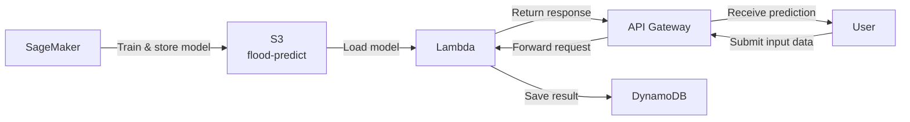

# Flood Prediction System

ระบบทำนายความเสี่ยงน้ำท่วมโดยใช้ Machine Learning บน AWS

## Architecture




### Flow การทำงาน

```
SageMaker → S3 → Lambda ← API Gateway ← User
                    ↓
                DynamoDB
```

| ขั้นตอน | บริการ | คำอธิบาย |
|--------|--------|-----------|
| 1 | SageMaker | Train โมเดลและบันทึกลง S3 |
| 2 | S3 | เก็บไฟล์โมเดล (`flood_risk_model.pkl`) และ dependencies |
| 3 | API Gateway | รับ request จาก user และส่งต่อไปยัง Lambda |
| 4 | Lambda | โหลดโมเดลจาก S3 แล้วทำนายผล |
| 5 | DynamoDB | บันทึกผลการทำนาย |
| 6 | User | ส่ง input และรับผลทำนายกลับมา |

## Input Features

| Feature | คำอธิบาย |
|---------|-----------|
| `frd_total_rainfall` | ปริมาณน้ำฝนสะสม (mm) |
| `Temperature` | อุณหภูมิ (°C) |
| `Humidity` | ความชื้นสัมพัทธ์ (%) |
| `Wind Speed` | ความเร็วลม (km/h) |

## API Usage

**Endpoint:** `POST /predict` (ผ่าน API Gateway)

**Request Body:**
```json
{
  "data": {
    "frd_total_rainfall": 120.5,
    "Temperature": 30.2,
    "Humidity": 85.0,
    "Wind Speed": 15.3
  }
}
```

**Response (Success):**
```json
{
  "statusCode": 200,
  "prediction": 1
}
```

**Response (Error):**
```json
{
  "statusCode": 400,
  "message": "Missing features: ['Humidity']"
}
```

> `prediction: 1` = มีความเสี่ยงน้ำท่วม, `prediction: 0` = ไม่มีความเสี่ยง

## AWS Resources

| Resource | ชื่อ |
|----------|------|
| S3 Bucket | `flood-predict` |
| S3 Keys | `flood_risk_model.pkl`, `dependencies.zip` |
| Lambda | `lambda_function.py` |

## Project Structure

```
.
├── lambda_function.py   # AWS Lambda handler
├── pipeline.jpg         # Architecture diagram
└── backend/             # Backend API server (Node.js)
    ├── server.js
    ├── controllers/
    ├── models/
    └── middleware/
```

## Prerequisites

- AWS account พร้อม permissions: S3, Lambda, API Gateway, DynamoDB, SageMaker
- Python 3.x (สำหรับ Lambda)
- Node.js (สำหรับ backend)
- ไฟล์ `flood_risk_model.pkl` และ `dependencies.zip` อัปโหลดไว้ใน S3 bucket `flood-predict` แล้ว
"# flood-prediction" 
